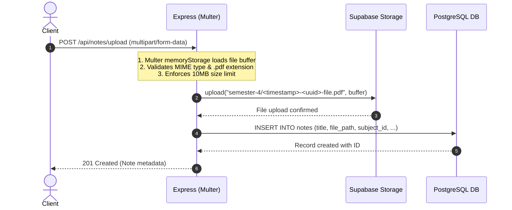
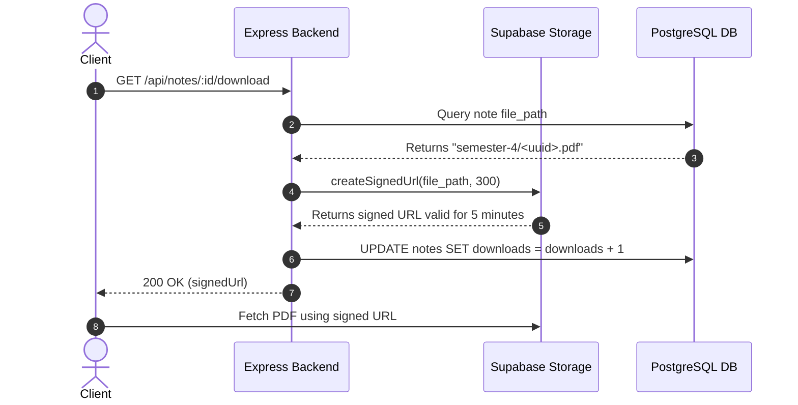

# 🎓 College Notes Sharing Platform — Backend API

A clean, modular, production-ready RESTful backend API for a College Notes Sharing Platform built with **Node.js**, **Express.js**, **Supabase PostgreSQL**, **Supabase Cloud Storage**, and **JWT Authentication**.

---

## 📑 Table of Contents

- [Overview](#overview)
- [Key Features](#key-features)
- [Tech Stack](#tech-stack)
- [Project Architecture & Directory Structure](#project-architecture--directory-structure)
- [Prerequisites](#prerequisites)
- [Environment Variables](#environment-variables)
- [Database & Supabase Setup](#database--supabase-setup)
  - [1. Database Tables & Relationships (SQL)](#1-database-tables--relationships-sql)
  - [2. Supabase Storage Bucket Configuration](#2-supabase-storage-bucket-configuration)
- [Installation & Running Locally](#installation--running-locally)
- [API Documentation & Endpoints](#api-documentation--endpoints)
  - [Standard Response Schema](#standard-response-schema)
  - [Authentication Routes](#authentication-routes)
  - [Notes Routes](#notes-routes)
  - [Subjects Routes](#subjects-routes)
  - [Users Routes](#users-routes)
- [Deep Dive: Architecture & Workflows](#deep-dive-architecture--workflows)
  - [1. How Supabase Connects to Node.js](#1-how-supabase-connects-to-nodejs)
  - [2. User Registration & Password Hashing Flow](#2-user-registration--password-hashing-flow)
  - [3. User Login Flow](#3-user-login-flow)
  - [4. JWT Authentication & Protected Routes](#4-jwt-authentication--protected-routes)
  - [5. PDF Upload Workflow](#5-pdf-upload-workflow)
  - [6. Secure PDF Download via Signed URLs](#6-secure-pdf-download-via-signed-urls)
  - [7. Role-Based Access Control (RBAC)](#7-role-based-access-control-rbac)
  - [8. Database Relationships & Foreign Keys](#8-database-relationships--foreign-keys)
  - [9. Scalability Strategy for High Volumes of PDFs](#9-scalability-strategy-for-high-volumes-of-pdfs)
- [Frontend Security Best Practices](#frontend-security-best-practices)
- [Deployment Guidelines](#deployment-guidelines)
- [License](#license)

---

## 📖 Overview

The **College Notes Sharing Platform Backend** allows college students and faculty to upload, discover, search, and download academic notes organized by semester and subject. The system is designed for high performance, enterprise security, and extreme scalability by separating relational metadata (in PostgreSQL) from binary document assets (in Supabase Cloud Storage).

---

## ✨ Key Features

- 🔐 **Secure Authentication**: User registration and login using industry-standard `bcrypt` salted password hashing and JSON Web Tokens (JWT).
- 🛡️ **Role-Based Authorization (RBAC)**: Fine-grained permissions differentiating between standard `student` users and `admin` moderators.
- 📁 **Cloud PDF Storage**: Uploads PDF files directly into private Supabase Cloud Storage without saving temporary files on server disk.
- 🗂️ **Organized File Hierarchies**: PDFs are partitioned by semester folders (`semester-1/` through `semester-8/`) with unique IDs to prevent naming collisions.
- 🔗 **Secure Signed Download URLs**: Generates time-limited signed URLs for downloading private PDF documents, preventing unauthorized link sharing.
- 📊 **Download Tracking**: Safely increments download metrics whenever a document download link is generated.
- 🔍 **Search & Filter Pagination**: Paginated listing of notes with full query support for keyword search, semester filtering, and subject filtering.
- 📚 **Academic Subjects Management**: Complete administrative CRUD for managing departments, subjects, and semesters.
- 🛑 **Centralized Error Handling**: Unified error middleware with clear JSON feedback across all failure modes (validation, duplicates, token expiry, storage limits).

---

## 🛠️ Tech Stack

| Component | Technology | Description |
| :--- | :--- | :--- |
| **Runtime** | [Node.js](https://nodejs.org/) (v18+) | Non-blocking, event-driven JavaScript engine |
| **Framework** | [Express.js](https://expressjs.com/) (v5+) | Minimalist, flexible web framework |
| **Database** | [Supabase PostgreSQL](https://supabase.com/) | Managed relational SQL database |
| **File Storage** | [Supabase Storage](https://supabase.com/storage) | S3-compatible cloud object storage for PDF assets |
| **Security** | [bcrypt](https://www.npmjs.com/package/bcrypt) | Blowfish-based adaptive one-way password hashing |
| **Auth Tokens** | [jsonwebtoken](https://www.npmjs.com/package/jsonwebtoken) | Cryptographic signature verification for stateless auth |
| **File Uploads** | [Multer](https://www.npmjs.com/package/multer) | In-memory multipart/form-data handler |
| **CORS** | [cors](https://www.npmjs.com/package/cors) | Configurable Cross-Origin Resource Sharing |
| **Environment**| [dotenv](https://www.npmjs.com/package/dotenv) | Zero-dependency environment variable loader |

---

## 📁 Project Architecture & Directory Structure

```text
college-notes-backend/
│
├── src/
│   ├── config/
│   │   └── supabase.js             # Supabase client initialization & service key check
│   │
│   ├── controllers/
│   │   ├── authController.js       # Register, login, get current user
│   │   ├── notesController.js      # Notes CRUD, PDF upload, signed URL generation
│   │   ├── subjectsController.js   # Subject listing & administrative CRUD
│   │   └── usersController.js      # Admin user directory listing
│   │
│   ├── middleware/
│   │   ├── authMiddleware.js       # Bearer token verification & admin role check
│   │   ├── errorMiddleware.js      # Centralized error and 404 handler
│   │   └── uploadMiddleware.js     # Multer config: memory storage & strict PDF filters
│   │
│   ├── routes/
│   │   ├── authRoutes.js           # Auth endpoint router (/api/auth)
│   │   ├── notesRoutes.js          # Notes endpoint router (/api/notes)
│   │   ├── subjectsRoutes.js       # Subjects endpoint router (/api/subjects)
│   │   └── usersRoutes.js          # Users endpoint router (/api/users)
│   │
│   ├── utils/
│   │   └── generateToken.js        # Signed JWT utility helper
│   │
│   ├── app.js                      # Express application setup, middlewares & routes
│   └── server.js                   # Server bootstrap & graceful shutdown listeners
│
├── supabase/
│   └── schema.sql                  # Complete PostgreSQL schema, indexes & storage setup
│
├── .env                            # Local environment configuration (git-ignored)
├── .env.example                    # Sample environment template with security notes
├── .gitignore                      # Git exclusion rules
├── package.json                    # Project metadata, dependencies & npm scripts
└── README.md                       # Complete project documentation
```

### Folder Responsibilities:
- **`src/config/`**: Manages connections to external services (Supabase DB and Cloud Storage).
- **`src/controllers/`**: Contains the core business logic, validating request data, executing queries, and returning standardized responses.
- **`src/middleware/`**: Intercepts requests before reaching controllers to perform JWT authentication, role verification, file parsing, or global error handling.
- **`src/routes/`**: Maps clean REST endpoints and HTTP methods to their appropriate middleware and controllers.
- **`src/utils/`**: Reusable helper functions (token generation, string manipulation).
- **`supabase/`**: Contains pure SQL scripts to bootstrap tables, constraints, foreign keys, indexes, and storage buckets.

---

## ⚙️ Prerequisites

- **Node.js** v18.0.0 or higher
- **npm** v9.0.0 or higher
- A free [Supabase](https://supabase.com/) account and project

---

## 🔑 Environment Variables

Create a `.env` file in the project root by copying `.env.example`:

```bash
cp .env.example .env
```

Configure your variables as follows:

```env
# Server Port
PORT=5000

# Supabase Project URL (found in: Supabase Dashboard -> Project Settings -> API)
SUPABASE_URL=https://xyzprojectid.supabase.co

# Supabase Service Role Secret Key (found in: Supabase Dashboard -> Project Settings -> API -> service_role)
# CRITICAL: This key bypasses Row-Level Security (RLS) and must NEVER be exposed to frontends!
SUPABASE_SERVICE_ROLE_KEY=eyJh...

# JWT Configuration
JWT_SECRET=use_a_strong_random_secret_key_here
JWT_EXPIRES_IN=7d

# Supabase Cloud Storage Bucket Name
SUPABASE_STORAGE_BUCKET=notes
```

> [!CAUTION]
> **CRITICAL SECURITY NOTE ON SUPABASE SERVICE ROLE KEY**:
> The `SUPABASE_SERVICE_ROLE_KEY` has full administrative power and bypasses all Row-Level Security (RLS) policies. It is designed **strictly for backend servers**. You must **NEVER** expose or commit this key to Git, send it to a client application, or bundle it in React/Vue/Angular frontend code.

---

## 🗄️ Database & Supabase Setup

### 1. Database Tables & Relationships (SQL)

Log in to your [Supabase Dashboard](https://app.supabase.com/), open the **SQL Editor**, and run the SQL code from [`supabase/schema.sql`](supabase/schema.sql):

```sql
-- Enable pgcrypto for UUID generation
CREATE EXTENSION IF NOT EXISTS "pgcrypto";

-- 1. Users Table
CREATE TABLE IF NOT EXISTS users (
    id UUID PRIMARY KEY DEFAULT gen_random_uuid(),
    name VARCHAR(255) NOT NULL,
    prn VARCHAR(9) NOT NULL UNIQUE,
    password TEXT NOT NULL,
    role VARCHAR(50) NOT NULL DEFAULT 'student' CHECK (role IN ('student', 'admin')),
    created_at TIMESTAMPTZ NOT NULL DEFAULT timezone('utc'::text, now()),
    CONSTRAINT chk_users_prn CHECK (prn ~ '^[0-9]{9}$')
);

CREATE INDEX IF NOT EXISTS idx_users_prn ON users(prn);

-- 2. Subjects Table
CREATE TABLE IF NOT EXISTS subjects (
    id UUID PRIMARY KEY DEFAULT gen_random_uuid(),
    name VARCHAR(255) NOT NULL,
    semester INT NOT NULL CHECK (semester >= 1 AND semester <= 8),
    department VARCHAR(255) NOT NULL,
    created_at TIMESTAMPTZ NOT NULL DEFAULT timezone('utc'::text, now())
);

CREATE INDEX IF NOT EXISTS idx_subjects_semester ON subjects(semester);
CREATE INDEX IF NOT EXISTS idx_subjects_department ON subjects(department);

-- 3. Notes Table
CREATE TABLE IF NOT EXISTS notes (
    id UUID PRIMARY KEY DEFAULT gen_random_uuid(),
    title VARCHAR(255) NOT NULL,
    description TEXT,
    subject_id UUID NOT NULL REFERENCES subjects(id) ON DELETE CASCADE,
    semester INT NOT NULL CHECK (semester >= 1 AND semester <= 8),
    file_name VARCHAR(255) NOT NULL,
    file_path TEXT NOT NULL,
    file_size BIGINT NOT NULL,
    uploaded_by UUID NOT NULL REFERENCES users(id) ON DELETE CASCADE,
    downloads INT NOT NULL DEFAULT 0 CHECK (downloads >= 0),
    created_at TIMESTAMPTZ NOT NULL DEFAULT timezone('utc'::text, now())
);

-- Foreign Key and Performance Indexes
CREATE INDEX IF NOT EXISTS idx_notes_subject_id ON notes(subject_id);
CREATE INDEX IF NOT EXISTS idx_notes_semester ON notes(semester);
CREATE INDEX IF NOT EXISTS idx_notes_uploaded_by ON notes(uploaded_by);
CREATE INDEX IF NOT EXISTS idx_notes_created_at ON notes(created_at DESC);
CREATE INDEX IF NOT EXISTS idx_notes_search ON notes USING gin(to_tsvector('english', title || ' ' || coalesce(description, '')));
```

### 2. Supabase Storage Bucket Configuration

1. In the Supabase Dashboard, go to **Storage** -> **Buckets**.
2. Click **New bucket**.
3. Set the bucket name to `notes`.
4. Ensure **Public bucket** is **DISABLED** (unchecked).
   *Leaving the bucket private ensures that only your backend can upload or generate signed URLs, preventing direct unauthorized file scraping.*
5. Alternatively, run this SQL in your Supabase SQL Editor:
   ```sql
   INSERT INTO storage.buckets (id, name, public)
   VALUES ('notes', 'notes', false)
   ON CONFLICT (id) DO NOTHING;
   ```

---

## 🚀 Installation & Running Locally

### 1. Install Dependencies
```bash
npm install
```

### 2. Start the Development Server (with auto-reload)
```bash
npm run dev
```

### 3. Start the Production Server
```bash
npm start
```

When started successfully, you will see:
```text
====================================================
🚀 College Notes Backend Server is running!
📍 Port: 5000
🌐 Base URL: http://localhost:5000
📚 API Health: http://localhost:5000/
⚡ Environment: development
====================================================
```

---

## 📡 API Documentation & Endpoints

### Standard Response Schema

Every response from the API follows a predictable, uniform structure:

#### Success Response
```json
{
  "success": true,
  "message": "Operation completed successfully",
  "data": {}
}
```

#### Error Response
```json
{
  "success": false,
  "message": "Descriptive reason for failure"
}
```

---

### Authentication Routes

Base URL: `/api/auth`

#### 1. Register User (Exclusively using 9-Digit PRN)
- **Method & URL**: `POST /api/auth/register`
- **Access**: Public
- **Request Body**:
  ```json
  {
    "name": "Alex Johnson",
    "prn": "123456789",
    "password": "Password123",
    "role": "student"
  }
  ```
  > [!NOTE]
  > - **PRN (Permanent Registration Number)**: Strictly 9 numeric digits (`/^\d{9}$/`). Must be unique across all college accounts. No college email required.
- **Response (`201 Created`)**:
  ```json
  {
    "success": true,
    "message": "User registered successfully with PRN.",
    "data": {
      "user": {
        "id": "c6218d6e-1d68-45b3-8ec2-35dbfcf66f1e",
        "name": "Alex Johnson",
        "prn": "123456789",
        "role": "student",
        "created_at": "2026-09-07T14:40:00.000Z"
      },
      "token": "eyJhbGciOiJIUzI1NiIsInR5cCI6IkpXVCJ9..."
    }
  }
  ```

#### 2. User Login (9-Digit PRN Authentication)
- **Method & URL**: `POST /api/auth/login`
- **Access**: Public
- **Request Body**:
  ```json
  {
    "prn": "123456789",
    "password": "Password123"
  }
  ```
- **Response (`200 OK`)**:
  ```json
  {
    "success": true,
    "message": "Login successful.",
    "data": {
      "user": {
        "id": "c6218d6e-1d68-45b3-8ec2-35dbfcf66f1e",
        "name": "Alex Johnson",
        "prn": "123456789",
        "role": "student",
        "created_at": "2026-09-07T14:40:00.000Z"
      },
      "token": "eyJhbGciOiJIUzI1NiIsInR5cCI6IkpXVCJ9..."
    }
  }
  ```

#### 3. Get Current User Profile
- **Method & URL**: `GET /api/auth/me`
- **Access**: Private (Requires `Authorization: Bearer <token>`)
- **Response (`200 OK`)**:
  ```json
  {
    "success": true,
    "message": "User profile retrieved successfully.",
    "data": {
      "user": {
        "id": "c6218d6e-1d68-45b3-8ec2-35dbfcf66f1e",
        "name": "Alex Johnson",
        "prn": "123456789",
        "role": "student",
        "created_at": "2026-09-07T14:40:00.000Z"
      }
    }
  }
  ```

---

### Notes Routes

Base URL: `/api/notes`

#### 1. List Notes (Paginated & Filterable)
- **Method & URL**: `GET /api/notes`
- **Access**: Private (Requires valid JWT)
- **Query Parameters**:
  - `page`: Page number (default: `1`)
  - `limit`: Number of items per page (default: `10`, max: `50`)
  - `search`: Keyword to search across title and description (e.g., `dbms`)
  - `semester`: Filter by semester integer (`1` to `8`)
  - `subject_id`: Filter by subject UUID
- **Example Request**: `GET /api/notes?page=1&limit=10&semester=4&search=database`
- **Response (`200 OK`)**:
  ```json
  {
    "success": true,
    "message": "Notes retrieved successfully.",
    "data": {
      "notes": [
        {
          "id": "8fa85b88-1a52-475a-bcfe-e274cf3aa0e4",
          "title": "DBMS Complete Handwritten Lecture Notes",
          "description": "Comprehensive notes covering Normalization, Transactions, and SQL queries.",
          "semester": 4,
          "file_name": "dbms_unit_1_4.pdf",
          "file_path": "semester-4/1725723901-d8a1e8a2-dbms_unit_1_4.pdf",
          "file_size": 4518290,
          "downloads": 42,
          "created_at": "2026-09-07T12:00:00.000Z",
          "uploaded_by": "c6218d6e-1d68-45b3-8ec2-35dbfcf66f1e",
          "subjects": {
            "id": "40b284e3-a65c-4d8b-967a-e4905d68019a",
            "name": "Database Management Systems",
            "department": "Computer Science",
            "semester": 4
          },
          "users": {
            "id": "c6218d6e-1d68-45b3-8ec2-35dbfcf66f1e",
            "name": "Alex Johnson",
            "email": "alex@college.edu"
          }
        }
      ],
      "page": 1,
      "limit": 10,
      "total": 1,
      "totalPages": 1
    }
  }
  ```

#### 2. Get Single Note by ID
- **Method & URL**: `GET /api/notes/:id`
- **Access**: Private (Requires valid JWT)
- **Response (`200 OK`)**:
  ```json
  {
    "success": true,
    "message": "Note details retrieved successfully.",
    "data": {
      "note": { ... }
    }
  }
  ```

#### 3. Upload Note (PDF + Metadata)
- **Method & URL**: `POST /api/notes/upload`
- **Access**: Private (Authenticated)
- **Headers**: `Authorization: Bearer <token>`, `Content-Type: multipart/form-data`
- **Form Data Fields**:
  - `file`: PDF file (`.pdf`, max 10MB)
  - `title`: String (e.g. `"Data Structures Trees & Graphs"`)
  - `description`: String (optional)
  - `subject_id`: UUID of existing subject
  - `semester`: Integer between `1` and `8`
- **Example cURL**:
  ```bash
  curl -X POST http://localhost:5000/api/notes/upload \
    -H "Authorization: Bearer YOUR_JWT_TOKEN" \
    -F "file=@/path/to/notes.pdf" \
    -F "title=Data Structures Trees & Graphs" \
    -F "description=Binary Search Trees and AVL Trees notes" \
    -F "subject_id=40b284e3-a65c-4d8b-967a-e4905d68019a" \
    -F "semester=3"
  ```
- **Response (`201 Created`)**:
  ```json
  {
    "success": true,
    "message": "Note uploaded successfully.",
    "data": {
      "note": {
        "id": "8fa85b88-1a52-475a-bcfe-e274cf3aa0e4",
        "title": "Data Structures Trees & Graphs",
        "file_name": "notes.pdf",
        "file_path": "semester-3/1725723901-d8a1e8a2-notes.pdf",
        "file_size": 2489123,
        "downloads": 0,
        "created_at": "2026-09-07T14:45:00.000Z"
      }
    }
  }
  ```

#### 4. Download Note (Secure Signed URL)
- **Method & URL**: `GET /api/notes/:id/download`
- **Access**: Private (Requires valid JWT)
- **Query Parameter**: `?redirect=true` (optional: directly redirects browser to signed URL)
- **Behavior**:
  1. Verifies note exists.
  2. Generates time-limited signed URL (valid for 5 minutes).
  3. Increments download counter in database by `+1`.
- **Response (`200 OK`)**:
  ```json
  {
    "success": true,
    "message": "Secure download URL generated successfully.",
    "data": {
      "downloadUrl": "https://xyzprojectid.supabase.co/storage/v1/object/sign/notes/semester-3/1725723901-notes.pdf?token=...",
      "expiresInSeconds": 300,
      "fileName": "notes.pdf"
    }
  }
  ```

#### 5. Update Note
- **Method & URL**: `PUT /api/notes/:id`
- **Access**: Private (Uploader or Admin)
- **Request Body**:
  ```json
  {
    "title": "Updated Note Title",
    "description": "Updated description content."
  }
  ```

#### 6. Delete Note
- **Method & URL**: `DELETE /api/notes/:id`
- **Access**: Private (Uploader or Admin)
- **Behavior**: Deletes the physical file from Supabase Cloud Storage and removes the record from the database.
- **Response (`200 OK`)**:
  ```json
  {
    "success": true,
    "message": "Note deleted successfully."
  }
  ```

---

### Subjects Routes

Base URL: `/api/subjects`

| Method | Endpoint | Access | Description |
| :--- | :--- | :--- | :--- |
| `GET` | `/api/subjects` | Public | List subjects (supports `?semester=3&department=Computer+Science`) |
| `POST` | `/api/subjects` | Admin Only | Create subject (`name`, `semester`, `department`) |
| `PUT` | `/api/subjects/:id` | Admin Only | Update subject details |
| `DELETE` | `/api/subjects/:id` | Admin Only | Delete subject |

---

### Users Routes

Base URL: `/api/users`

| Method | Endpoint | Access | Description |
| :--- | :--- | :--- | :--- |
| `GET` | `/api/users` | Admin Only | List registered users (supports `?role=student\|admin`) |

---

## 🔍 Deep Dive: Architecture & Workflows

### 1. How Supabase Connects to Node.js
We initialize the official Supabase JavaScript SDK (`@supabase/supabase-js`) in `src/config/supabase.js`.

```javascript
import { createClient } from '@supabase/supabase-js';

export const supabase = createClient(
  process.env.SUPABASE_URL,
  process.env.SUPABASE_SERVICE_ROLE_KEY,
  {
    auth: {
      persistSession: false,
      autoRefreshToken: false,
    },
  }
);
```
- **PostgreSQL Connection**: Queries are dispatched via Supabase's PostgREST gateway using an intuitive chaining API (`supabase.from('notes').select(...)`).
- **Cloud Storage Connection**: File operations are dispatched via Supabase's Storage API (`supabase.storage.from('notes').upload(...)`).

### 2. User Registration & Password Hashing Flow
1. User sends `{ name, email, password, role }`.
2. Input sanitization normalizes the email to lowercase and trims whitespace.
3. The controller checks whether an account with that email already exists.
4. Passwords are never saved as plain text: `bcrypt.hash(password, 10)` generates an adaptive salt and hashes the password.
5. The record is inserted into the `users` table.
6. A signed JWT containing `{ userId }` is generated and returned with user metadata. The password is completely omitted from the response.

### 3. User Login Flow
1. User sends `{ email, password }`.
2. The user record is fetched from the `users` table.
3. `bcrypt.compare(password, user.password)` cryptographically checks the plaintext candidate against the stored bcrypt hash.
4. If valid, a new JWT is signed and returned alongside user details.

### 4. JWT Authentication & Protected Routes
1. The client includes the token in the HTTP header:
   ```http
   Authorization: Bearer <token>
   ```
2. `authMiddleware.authenticate` extracts the token and verifies its cryptographic signature using `jwt.verify(token, process.env.JWT_SECRET)`.
3. If valid, it queries the database for the user (`id`, `name`, `email`, `role`, `created_at`).
4. The user profile is attached to `req.user`, allowing downstream handlers to inspect permissions.

### 5. PDF Upload Workflow


### 6. Secure PDF Download via Signed URLs


### 7. Role-Based Access Control (RBAC)
- **Normal Student**: Can upload notes, view and download notes, search/filter notes, and update/delete **only the notes they uploaded**.
- **Admin**: Can delete **any** note (moderation), view user listings, and manage subjects/departments.

### 8. Database Relationships & Foreign Keys
- `notes.subject_id` ➔ `subjects.id` (`ON DELETE CASCADE`): Ensures all notes belonging to a subject are safely removed if a subject is deleted.
- `notes.uploaded_by` ➔ `users.id` (`ON DELETE CASCADE`): Ensures notes are attributed to their author and cascade on user deletion.

### 9. Scalability Strategy for High Volumes of PDFs
To handle hundreds of thousands of files without degrading performance:
1. **Zero Binary Storage in DB**: PostgreSQL stores only file metadata (~200 bytes per row). File binary blobs live entirely in cloud object storage.
2. **Deterministic Partitioning**: Files are partitioned by semester folders (`notes/semester-1/...`, `notes/semester-8/...`), preventing huge flat folder listings.
3. **Database Indexing**: B-tree indexes on `subject_id`, `semester`, `uploaded_by`, and `created_at` ensure sub-millisecond query latency during high concurrency.
4. **Mandatory Pagination**: Notes queries require `page` and `limit`, preventing memory spikes from massive result sets.
5. **Signed Expirable URLs**: Downloads are offloaded directly to cloud storage CDN URLs, freeing Node.js threads from streaming large files.

---

## 🔒 Frontend Security Best Practices

When integrating a frontend (React, Vue, Next.js, etc.) with this backend:

1. **Storage of JWTs**:
   - For web clients, the most secure approach against XSS attacks is storing tokens in **HttpOnly, Secure, SameSite=Strict cookies** rather than `localStorage`.
   - If using `localStorage` for quick prototypes, ensure strict Content Security Policies (CSP) and sanitize all rendered user content to prevent script injection.
2. **Never Expose Admin Keys**:
   - The Supabase Service Role Key must **never** be present in frontend `.env` or client bundles. All uploads and queries should pass through this Express API.
3. **Handle Expired Tokens**:
   - Listen for `401 Unauthorized` responses and automatically redirect users to your login screen.

---

## 🚢 Deployment Guidelines

This backend is ready to deploy to any modern cloud container platform:

### 1. Render / Railway / Fly.io / Heroku
- Set the start command to: `npm start`
- Set environment variables in your platform dashboard:
  - `PORT=5000` (or leave default for dynamic port injection)
  - `SUPABASE_URL`
  - `SUPABASE_SERVICE_ROLE_KEY`
  - `JWT_SECRET`
  - `JWT_EXPIRES_IN=7d`
  - `SUPABASE_STORAGE_BUCKET=notes`
  - `NODE_ENV=production`

### 2. Docker (Optional)
A standard Node.js Dockerfile:
```dockerfile
FROM node:20-alpine
WORKDIR /app
COPY package*.json ./
RUN npm ci --only=production
COPY . .
EXPOSE 5000
CMD ["node", "src/server.js"]
```

---

## 📄 License

This project is licensed under the ISC License.
